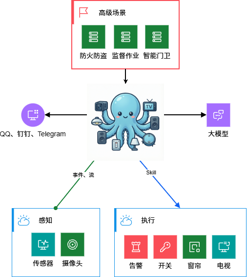

# HomeOcto 开发者指南

> 本文档面向开发者，包含架构设计、编译构建、设备接入开发、贡献指南等内容。

---

## 🏗️ 架构设计

### 系统架构



### 🧠 核心能力

| 分类 | 模块 | 状态 | 说明 |
|:---|:---|:---|:---|
| **意图识别** |  | 🚧 开发中 | 基于本地小模型实现意图识别与路由 |
| **工作流引擎** |  | 🚧 开发中 | 大模型生成工作流、小模型调用执行、加速执行速度 |
| **基础能力** | jsonStore | ✅ 已完成 | JSON 数据存储 |
| | eventCenter | ✅ 已完成 | 事件中心 |
| | ffmpeg封装 | ✅ 已完成 | 音视频处理 |
| | yolo能力 | ✅ 已完成 | 目标检测 |
| **基础对象** | home | ✅ 已完成 | 家庭 |
| | room | ✅ 已完成 | 房间 |
| | device | ✅ 已完成 | 设备 |
| **llm执行** |  | ✅ 已完成 | 大模型调用执行 |

---

## 📦 编译构建

### Linux / macOS 编译

```bash
# 生成 homeocto 可执行程序
make build

# 生成 homeocto-launcher 可执行程序
make build-launcher

# 生成 homeocto 各个平台的可执行程序
make build-all
```

### Windows 编译

Windows 系统缺少 make 命令，使用 PowerShell 脚本：

```powershell
# 生成 homeocto、homeocto-launcher 2个可执行程序
..\..\scripts\build-windows.ps1
```

### 项目结构

```
homeocto/
├── cmd/homeocto/              # 主程序入口
│   ├── main.go               # 程序入口
│   └── internal/             # 内部命令模块
│       ├── agent/            # Agent 命令
│       ├── auth/             # 认证命令
│       ├── cliui/            # CLI 界面
│       ├── cron/             # 定时任务
│       ├── gateway/          # 网关
│       ├── migrate/          # 数据迁移
│       ├── model/            # 模型管理
│       ├── onboard/          # 初始化向导
│       ├── skills/           # 技能管理
│       ├── status/           # 状态查询
│       └── version/          # 版本信息
├── pkg/                      # 核心功能包
│   ├── channels/             # 通信渠道
│   ├── config/               # 配置管理
│   ├── data/                 # 数据模型
│   ├── event/                # 事件系统
│   ├── gateway/              # 网关实现
│   ├── intent/               # 意图识别
│   ├── ioc/                  # 依赖注入
│   ├── llm/                  # LLM 接口
│   ├── third/                # 第三方平台接入
│   │   ├── homekit/          # HomeKit
│   │   ├── ioc/              # IOC
│   │   ├── miio/             # 小米
│   │   └── tuya/             # 涂鸦
│   ├── tool/                 # 工具集
│   ├── utils/                # 工具函数
│   └── workflow/             # 工作流引擎
├── web/                      # Web 界面
│   ├── backend/              # 后端服务
│   │   ├── api/              # API 接口
│   │   ├── homeocto/         # HomeOcto 相关接口
│   │   └── middleware/       # 中间件
│   └── frontend/             # 前端应用
│       └── src/              # 源代码
├── workspace/                # 工作空间
│   ├── memory/               # 记忆系统
│   └── skills/               # 技能定义
├── scripts/                  # 构建脚本
├── doc/                      # 文档
└── test_dst/                 # 测试目标
```

---

## 🔌 设备接入开发

### 接入方式

HomeOcto 提供两种设备接入方式：

1. **Client 接口实现**（推荐）：跨平台兼容性好
2. **Skill 方式**：待定，暂不支持

### 🔌 Client 接口实现

为保证跨平台兼容性，推荐使用实现 Client 接口的方式接入新设备品牌。

#### Client 接口定义

```go
// 身份识别
Brand() string  // 返回品牌名称

// 查询方法
GetHomes() ([]*HomeInfo, error)              // 获取家庭列表
GetRooms(homeID string) ([]*data.Space, error)   // 获取房间列表
GetDevices(homeID string) ([]*data.Device, error) // 获取设备列表
GetSpec(deviceID string) (*SpecInfo, error)   // 获取设备规格

// 设备控制
Execute(params map[string]any) (map[string]any, error)  // 执行设备动作
GetProps(params map[string]any) (any, error)            // 获取设备属性
SetProps(params map[string]any) (any, error)            // 设置设备属性

// 事件管理
EnableEvent(params map[string]any) error   // 启用事件订阅
DisableEvent(params map[string]any) error  // 禁用事件订阅

// 视频流
GetRtspStr(deviceID string) (string, error)  // 获取RTSP视频流URL
```

#### 实现示例

参考现有实现：
- 涂鸦客户端：`../pkg/third/tuya/tuya_client.go`
- 小米客户端：`../pkg/third/miio/mi_client.go`

#### 前端授权页面

前端页面主要用于设备授权管理：
- 页面组件：`../web/frontend/src/homeocto/components/tuya-page.tsx`
- 后端 API：`../web/backend/api/homeocto/tuya.go`

### 🔐 视频授权管理

参考 [go2rtc](https://github.com/AlexxIT/go2rtc) 实现图形化设备授权管理。

---

## 📋 配置说明

### 首次启动配置

首次启动时，系统会自动进入 Web UI 向导，引导完成以下配置：

1. **AI 模型配置**：选择本地模型或云端模型
2. **渠道绑定**：配置微信、钉钉、Telegram 等通信渠道
3. **设备扫描**：自动发现和同步设备

### 模型配置示例

使用本地 Ollama 模型：

```json
{
  "model_name": "ollama-qwen-small",
  "model": "ollama/sorc/qwen3.5-claude-4.6-opus-q4:4b",
  "api_base": "http://127.0.0.1:11434/v1",
  "api_key": "local"
}
```

---

## 🚀 开发工作流

### 环境要求

- **Go**：1.21+
- **Node.js**：18+（前端开发）
- **Make**：构建工具（Windows 使用 PowerShell 脚本替代）

### 开发流程

1. **Fork 项目**：创建自己的仓库分支
2. **创建特性分支**：`git checkout -b feature/your-feature`
3. **开发实现**：按照代码规范编写代码
4. **运行测试**：确保所有测试通过
5. **提交代码**：遵循 Git 提交规范
6. **发起 PR**：提交 Pull Request 等待审核

### 代码规范

- 遵循 Go 官方代码规范
- 使用 `gofmt` 格式化代码
- 添加必要的注释和文档
- 编写单元测试

---

## 🤝 参与贡献

HomeOcto 目前处于 Alpha 阶段，核心架构与 Skill 契约已稳定，欢迎早期体验者与开发者加入：

- 🐛 **提交 Issue**：功能建议、Bug 反馈、生态兼容性问题
- 🔀 **提交 PR**：Skill 插件开发、协议适配、UI/交互优化
- 📖 **完善文档**：部署教程、场景模板、硬件兼容列表

详见 [CONTRIBUTING.md](./CONTRIBUTING.md)

---

## 📊 开发路线图

详细的开发路线图请参考 [ROADMAP.md](./roadmap.md)

主要开发方向：

1. **品牌接入**：按优先级依次接入各品牌设备
2. **移动端开发**：Android/iOS 应用开发
3. **内核能力**：意图识别、工作流引擎、空间感知等

---

## 🙏 致谢

HomeOcto 站在众多优秀开源项目的肩膀上，向以下项目致以诚挚感谢：

- [**picoclaw**](https://github.com/sipeed/picoclaw) — 核心 AI Agent 引擎，提供多渠道对话与工具调度能力
- [**go2rtc**](https://github.com/AlexxIT/go2rtc) — 高性能实时流媒体框架，支持摄像头接入与音视频转发
- [**FFmpeg**](https://ffmpeg.org) — 多媒体处理基础设施，音视频编解码与流处理的行业标准
- [**React**](https://react.dev/) — 前端 UI 框架
- [**Vite**](https://vitejs.dev/) — 前端构建工具
- [**Gin**](https://github.com/gin-gonic/gin) — Go Web 框架
- 以及其他所有为 HomeOcto 提供支持的开源项目

---

> **"让每一台设备专注执行，让每一次交互充满智慧。"**  
> 🐾 **HomeOcto** —— AI 时代的智能家居大脑。
