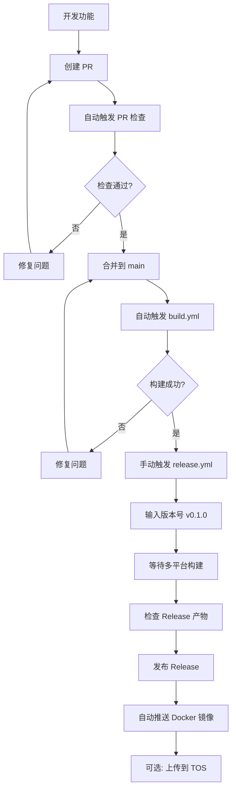

# HomeOcto GitHub Actions 使用指南

## 📋 目录

1. [必需账号申请](#1-必需账号申请)
2. [GitHub 仓库配置](#2-github-仓库配置)
3. [工作流使用说明](#3-工作流使用说明)
4. [常见问题排查](#4-常见问题排查)

---

## 1. 必需账号申请

### 1.1 GitHub 账号 ✅
- **状态**: 必须有
- **用途**: 代码托管、CI/CD、Release 发布
- **申请**: https://github.com/signup

### 1.2 DockerHub 账号（可选）
- **状态**: 推荐申请（用于 Docker 镜像分发）
- **用途**: 存储和分发 HomeOcto Docker 镜像
- **申请**: https://hub.docker.com/signup

**申请步骤**:
1. 访问 https://hub.docker.com/signup
2. 填写用户名、邮箱、密码
3. 验证邮箱
4. 创建 Personal Access Token:
   - 登录 DockerHub
   - 点击右上角头像 → Account Settings
   - 左侧菜单 Security → New Access Token
   - 描述填写 "HomeOcto CI/CD"
   - 权限选择 `Read & Write`
   - 复制生成的 Token（只显示一次）

### 1.3 Apple Developer Program（可选）
- **状态**: 可选（仅用于 macOS 应用签名和公证）
- **用途**: 避免 macOS 显示"未知开发者"警告
- **费用**: $99/年
- **申请**: https://developer.apple.com/programs/

**如果您暂时不需要 macOS 版本，可以跳过此步骤。**

### 1.4 火山引擎 TOS（可选）
- **状态**: 可选（用于中国大陆加速下载）
- **用途**: 对象存储，提供国内高速下载
- **费用**: 按量付费（很便宜）
- **申请**: https://www.volcengine.com/

**申请步骤**:
1. 注册火山引擎账号并完成实名认证
2. 开通对象存储 TOS 服务
3. 创建 Bucket:
   - 进入 TOS 控制台
   - 创建 Bucket，名称如 `homeocto-downloads`
   - 访问权限选择"公共读"
   - 区域选择"华北2（北京）"
4. 获取访问密钥:
   - 点击右上角账号 → 访问密钥
   - 创建新密钥（Access Key ID + Secret Access Key）
   - 复制并保存（只显示一次）

---

## 2. GitHub 仓库配置

### 2.1 推送代码到 GitHub

```bash
# 进入项目目录
cd g:\code\homeocto

# 初始化 Git 仓库（如果还没有）
git init

# 添加所有文件
git add .

# 创建提交
git commit -m "feat: Initial commit with CI/CD configuration"

# 创建 main 分支
git branch -M main

# 添加远程仓库（替换为您的仓库地址）
git remote add origin https://github.com/YOUR_USERNAME/homeocto.git

# 推送到 GitHub
git push -u origin main
```

### 2.2 配置 Secrets（重要！）

在 GitHub 仓库中配置 Secrets：

1. 进入您的 GitHub 仓库
2. 点击 **Settings** → **Secrets and variables** → **Actions**
3. 点击 **New repository secret**

#### 必需配置的 Secrets

| Secret 名称 | 值 | 说明 | 是否必需 |
|------------|-----|------|---------|
| `DOCKERHUB_USERNAME` | 您的 DockerHub 用户名 | 如 `myusername` | 可选* |
| `DOCKERHUB_TOKEN` | DockerHub Access Token | 之前创建的 Token | 可选* |
| `VOLC_TOS_ACCESS_KEY` | 火山引擎 Access Key | TOS 访问密钥 | 后期配置 |
| `VOLC_TOS_SECRET_KEY` | 火山引擎 Secret Key | TOS 密钥 | 后期配置 |

**注**: 标记为"可选"的 Secrets，如果不配置，对应功能会被自动跳过。

#### macOS 签名 Secrets（仅 macOS 发布需要）

| Secret 名称 | 值 | 说明 |
|------------|-----|------|
| `MACOS_SIGN_P12` | Base64 编码的 P12 证书 | Apple 开发者证书 |
| `MACOS_SIGN_PASSWORD` | 证书密码 | P12 文件的密码 |
| `MACOS_NOTARY_ISSUER_ID` | Issuer ID | Apple 公证服务 ID |
| `MACOS_NOTARY_KEY_ID` | Key ID | API Key ID |
| `MACOS_NOTARY_KEY` | Base64 编码的 API Key | 公证 API Key |

**如何获取 macOS 签名证书**:
1. 登录 Apple Developer Portal
2. 创建 Developer ID Application 证书
3. 下载并安装到 Keychain
4. 导出为 .p12 文件
5. 转换为 Base64: `base64 -i certificate.p12`

### 2.3 配置 Variables

1. 进入 **Settings** → **Secrets and variables** → **Actions**
2. 切换到 **Variables** 标签
3. 点击 **New repository variable**

#### 必需配置的 Variables

| Variable 名称 | 值 | 示例 |
|--------------|-----|------|
| `DOCKERHUB_REPOSITORY` | DockerHub 仓库路径 | `myusername/homeocto` |

---

## 3. 工作流使用说明

### 3.1 可用工作流总览

| 工作流 | 触发方式 | 功能 | 文件 |
|-------|---------|------|------|
| **PR 检查** | 创建 PR 时自动 | 代码检查、安全扫描、测试 | `pr.yml` |
| **主分支构建** | 推送到 main 自动 | 基础构建验证 | `build.yml` |
| **版本发布** | 手动触发 | 正式发布多平台版本 | `release.yml` |
| **夜间构建** | 每日自动/手动 | 最新开发版本 | `nightly.yml` |
| **Docker 构建** | 被 release 调用 | 构建 Docker 镜像 | `docker-build.yml` |
| **TOS 上传** | 被 release 调用 | 上传到火山引擎 | `upload-tos.yml` |
| **macOS DMG** | 手动触发 | 打包 macOS 安装器 | `create_dmg.yml` |

### 3.2 触发 PR 检查

**何时使用**: 开发新功能或修复 Bug 时

**操作步骤**:
1. 创建新分支: `git checkout -b feature/my-feature`
2. 提交代码修改
3. 推送到 GitHub: `git push origin feature/my-feature`
4. 在 GitHub 创建 Pull Request
5. 自动触发检查：
   - ✅ GolangCI-Lint 代码风格检查
   - ✅ Govulncheck 安全漏洞扫描
   - ✅ Go Test 单元测试

**查看结果**:
- PR 页面底部显示检查状态
- 点击 Details 查看日志

### 3.3 正式发布版本

**何时使用**: 准备发布新版本时（如 v0.1.0）

**操作步骤**:
1. 确保 main 分支代码稳定
2. 进入 GitHub 仓库 → **Actions** 标签
3. 左侧选择 **Create Tag and Release**
4. 点击 **Run workflow** 按钮
5. 填写参数:
   - **Release tag**: 版本号（如 `v0.1.0`）✅ 必填
   - **Mark as pre-release**: 是否标记为预发布（测试版选 true）
   - **Create as draft**: 是否创建为草稿（先不公开选 true）
   - **Upload to Volcengine TOS**: 是否上传到国内镜像（默认 false，后期有用户后再启用）
6. 点击 **Run workflow** 开始

**构建产物**:
```
Release v0.1.0
├── homeocto_Linux_x86_64.tar.gz
├── homeocto_Linux_arm64.tar.gz
├── homeocto_Windows_x86_64.zip
├── homeocto_Darwin_arm64.tar.gz
├── homeocto_Darwin_x86_64.tar.gz
├── homeocto_x86_64.deb
├── homeocto_x86_64.rpm
├── homeocto-android-universal.zip
├── checksums.txt
└── Docker 镜像 (自动推送到 DockerHub)
```

**预计时间**: 15-30 分钟（多平台编译）

### 3.4 夜间构建（Nightly Build）

**何时使用**: 想获取最新开发版本，或测试 CI/CD 是否正常

**自动触发**: 每天 UTC 00:00（北京时间 08:00）

**手动触发**:
1. Actions → **Nightly Build**
2. 点击 **Run workflow**
3. 等待完成

**特点**:
- 版本号格式: `v0.1.0-nightly.20260502.abc12345`
- 自动删除旧版本，只保留最新 nightly
- 标记为 Pre-release

### 3.5 构建 macOS DMG

**何时使用**: 需要 macOS 安装器文件

**操作步骤**:
1. Actions → **Create macOS DMG**
2. 点击 **Run workflow**
3. 完成后在 Artifacts 下载

**产物**:
- `macos-dmg-arm64`: Apple Silicon (M1/M2/M3)
- `macos-dmg-amd64`: Intel Mac

### 3.6 查看构建日志

1. 进入 **Actions** 标签
2. 点击任意工作流运行记录
3. 查看各个 Job 的详细日志
4. 点击展开每个 Step 查看输出

---

## 4. 常见问题排查

### 4.1 工作流没有自动运行

**症状**: 推送代码后 Actions 没有触发

**排查步骤**:
1. 检查 `.github/workflows/` 是否存在
2. 检查 YAML 语法是否正确（使用 https://yamlchecker.com/）
3. 检查仓库 Settings → Actions → General
   - 确保 "Allow all actions and reusable workflows" 已选中
4. 检查提交是否在 main 分支

### 4.2 Docker 推送失败

**错误信息**: `denied: requested access to the resource is denied`

**解决方案**:
1. 检查 `DOCKERHUB_USERNAME` Secret 是否正确
2. 检查 `DOCKERHUB_TOKEN` 是否过期，重新生成
3. 检查 `DOCKERHUB_REPOSITORY` Variable 格式是否正确（如 `username/homeocto`）
4. 确认 DockerHub 仓库已创建（或设置为自动创建）

### 4.3 Android 构建失败

**错误信息**: `make: *** No rule to make target 'build-android-bundle'`

**解决方案**:
1. 检查 `Makefile` 是否包含 `build-android-bundle` 目标
2. 检查前端是否已构建: `cd web/frontend && pnpm build:backend`
3. 检查 Go 版本是否 >= 1.25.9

### 4.4 macOS 签名失败

**错误信息**: `error: MACOS_SIGN_P12 is not set`

**解决方案**:
1. 如果不需要 macOS 签名，忽略此错误（构建仍会继续）
2. 如果需要签名，检查 5 个 macOS Secrets 是否都已配置
3. 检查 P12 证书是否过期

### 4.5 TOS 上传失败

**错误信息**: `AccessDenied: Access Denied`

**解决方案**:
1. 检查 `VOLC_TOS_ACCESS_KEY` 和 `VOLC_TOS_SECRET_KEY` 是否正确
2. 检查 TOS Bucket 是否存在且权限设置为"公共读"
3. 检查 Bucket 区域是否为 `cn-beijing`
4. 测试本地上传: `aws s3 ls s3://homeocto-downloads/ --endpoint-url https://tos-s3-cn-beijing.volces.com`

### 4.6 构建时间过长

**优化建议**:
1. 减少构建平台（在 `.goreleaser.yaml` 中注释掉不需要的平台）
2. 启用 GitHub Actions 缓存
3. 减少 Docker 镜像平台（如只保留 amd64 和 arm64）

### 4.7 本地测试工作流

使用 [act](https://github.com/nektos/act) 工具在本地运行 GitHub Actions:

```bash
# 安装 act
brew install act  # macOS
# 或
winget install nektos.act  # Windows

# 测试 PR 工作流
act pull_request

# 测试特定 Job
act -j lint

# 使用完整镜像（可能需要更多空间）
act --container-architecture linux/amd64
```

---

## 5. 快速开始清单

按以下顺序配置，确保 CI/CD 正常运行：

### ✅ 基础配置（必须）
- [ ] 1. 创建 GitHub 仓库并推送代码
- [ ] 2. 确保 `.github/workflows/` 目录存在
- [ ] 3. 推送一次到 main 分支，触发 build.yml

### ✅ Docker 支持（推荐）
- [ ] 4. 注册 DockerHub 账号
- [ ] 5. 创建 Access Token
- [ ] 6. 配置 Secrets: `DOCKERHUB_USERNAME`, `DOCKERHUB_TOKEN`
- [ ] 7. 配置 Variable: `DOCKERHUB_REPOSITORY`
- [ ] 8. 手动触发一次 release 测试

### ✅ 国内加速（后期配置）
> 💡 **说明**: TOS 上传功能已默认禁用，等后期有国内用户后再启用
- [ ] 9. 注册火山引擎账号
- [ ] 10. 创建 TOS Bucket
- [ ] 11. 配置 Secrets: `VOLC_TOS_ACCESS_KEY`, `VOLC_TOS_SECRET_KEY`
- [ ] 12. 发布版本时手动开启 TOS 上传选项

### ✅ macOS 签名（可选）
- [ ] 13. 加入 Apple Developer Program
- [ ] 13. 创建开发者证书
- [ ] 14. 配置 5 个 macOS Secrets

---

## 6. 版本发布建议流程



---

## 7. 有用的链接

- **GitHub Actions 文档**: https://docs.github.com/en/actions
- **GoReleaser 文档**: https://goreleaser.com/
- **Docker Hub**: https://hub.docker.com/
- **YAML 校验工具**: https://yamlchecker.com/
- **act (本地运行 Actions)**: https://github.com/nektos/act

---

**最后更新**: 2026-05-02  
**维护者**: HomeOcto Team
